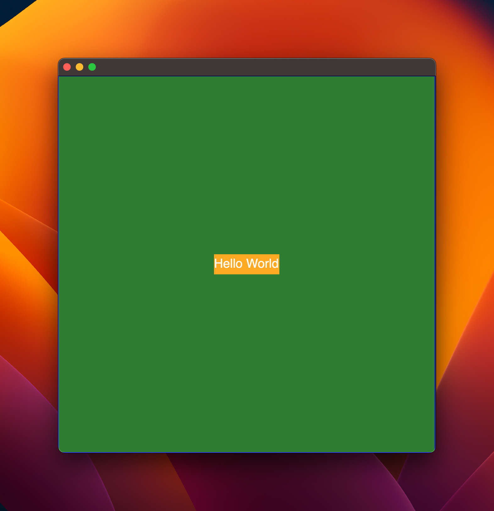

# deno_gpui

Experiment how to use JSX to create UI with [GPUI](https://github.com/zed-industries/zed/tree/main/crates/gpui).

Inspired by [littledivy/wgui](https://github.com/littledivy/wgui).

## Example

```tsx
/* @jsx h */
import { Div, h, render } from "deno_gpui/mod.ts";

function App() {
  return (
    <Div
      flex
      justify_center
      items_center
      shadow_lg
      border
      border_color={0x0000ff}
      text_xl
      text_color={0xffffff}
      bg={0x2e7d32}
      size="600px"
    >
      <Div bg={0xffaa22} size="auto">
        Hello World
      </Div>
    </Div>
  );
}

render(<App />);
```


